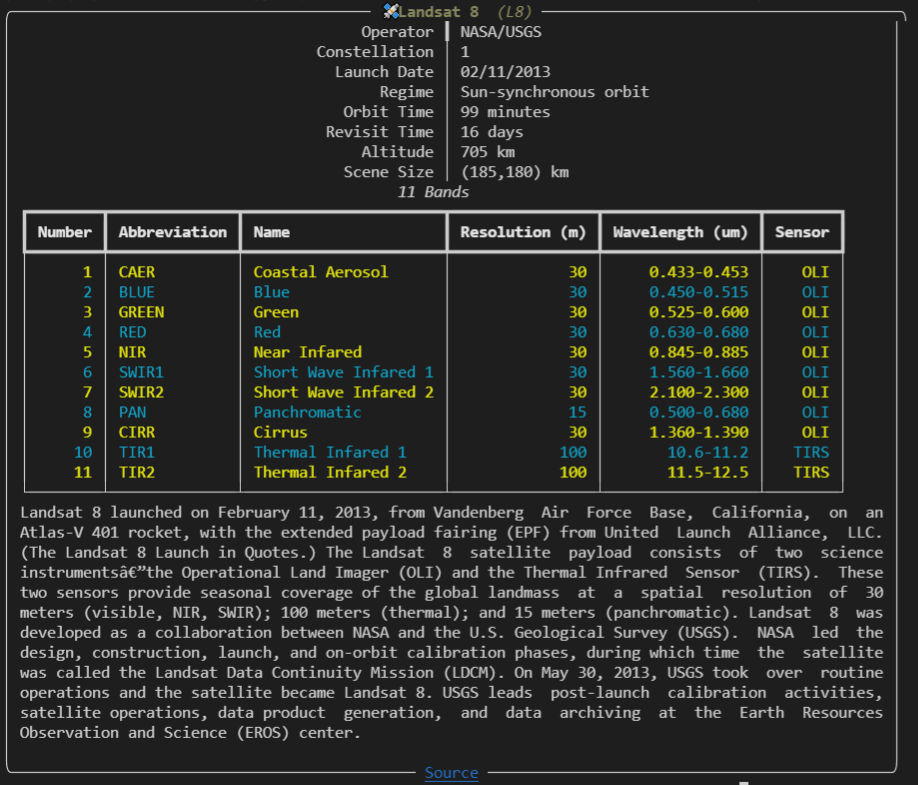
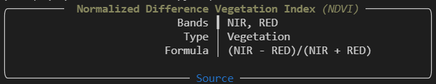

<br/>
<p align="center">
  <a href="https://github.com/mtralka/EOPlatform">
    
  </a>

  <h3 align="center">An Earth Observation Platform</h3>

  <p align="center">
    Earth Observation made easy. 
    <br/>
    <br/>
    <a href="https://github.com/mtralka/EOPlatform/issues">Report Bug</a>
    |
    <a href="https://github.com/mtralka/EOPlatform/issues">Request Feature</a>
  </p>
</p>

   <br/>   [](https://github.com/psf/black) 

## About

*eoplatform* is a Python package that aims to simplify Remote Sensing Earth Observation by providing actionable information on a wide swath of RS platforms and provide a simple API for downloading and visualizing RS imagery. Made for scientists, educators, and hobbiests alike.

* Easy access to information on RS platforms
* `metadata` module for extracting platform metadata
  * supports `.txt` and `.xml` files
* `composites` modules for creating and learning about 91 RS band composites

Coming soon:

* Data downloading
  * Landsat 8
  * Sentinel-2
* Raster tools
  * Raster IO functions

### Installation

`eoplatform` can be installed by running `pip install eoplatform`. It requires Python 3.7 or above to run. 

### Example


## Usage

*eoplatform* is accessible through the command line (CLI) and as a module import.

### Querying information

#### ...through CLI

`NAME` is any supported composite or platform (case-insensitive)

```sh
Usage: eoplatform info [OPTIONS] NAME

Arguments:
  NAME  [required]

Options:
  -b, --only-bands
   / -nd, --no-description  [default: True]
  --help                    Show this message and exit.
```

EX:

**Show all information on `landsat8`**

```sh
eoplatform info landsat8
```



**Show only `landsat8` bands**

```sh
eoplatform info landsat8 -b
```

**Show information on composite `NDVI`**

```sh
eoplatform info ndvi
```



#### ...through imports

You can search through the `eoplatform` module

```python
import eoplatform as eop

eop.info("Landsat8")  # case insensitive
eop.info("NDVI)
```

Or import your exact platform/composite

```python
from eoplatform.platforms import landsat8
from eoplatform.composites import NDVI

landsat8.info()  # OR print(landsat8)
NDVI.info()  # or print(NDVI)
```

### Band composites

Importable through `eoplatforms.composites` or searchable (shown above) from `eoplatform.info()`

See [implemented composite data dir](/eoplatform/data/composites) for the exact implemented composites (inspired by [awesome spectral indices](https://github.com/davemlz/awesome-spectral-indices))

#### Composite information

```python
from eoplatform.composites import NDVI  # DVI, etc

NDVI.info()
```

#### Creating composite

Composites bands must be passed in as keyword arguments assigned to NumPy arrays.

```python
from eoplatform.composites import NDVI

red_array: np.ndarray = ...
nir_array: np.ndarray = ...

ndvi: np.ndarray = NDVI.create(NIR=nir_array, RED=red_array)
```

### Metadata extraction

Supports `.txt` and `.xml` files through `extract_XML_metadata` and `extract_TXT_metadata`.

```python
from eoplatform.metadata import extract_XML_metadata

file_path: str = ...
target_attributes: List[str] = ...

values: Dict[str, str] = extract_XML_metadata(file_path, target_attributes)
```

## Adding platforms / composites

Platforms and composites are auto-generated from `/data/(composites,platforms)`. To add platforms or composites, simply create a new json file in the desired directory.

Platforms must have:

```python
abbreviation: str
name: str
```

### Platform

#### Example platform JSON

Standard key with value:

```json
...
"abbreviation": "L8",
//snip
...
```

Key with value and metadata:

```json
"altitude": {
    "meta": {
      "unit": "km"
    },
    "value": 705
  }
//snip
```

#### Bands standard for Platform key `bands`

Platform key for `bands` must be a list of following the `band` standard. EX:

```json
"bands": [
    {
      "abbreviation": "CAER",
      "description":"",
      "name": "Coastal Aerosol",
      "number": 1,
      "resolution": "30",
      "sensor": "OLI",
      "wavelength": "0.433-0.453"
    },
  //snip
]
```

#### Band standard for el in `bands`

Each element to `bands` is a `band`. Each band must have:

```python
number: int
name: str
abbreviation: str
```

### Composites

Composites must have:

```python
abbreviation: str
formula: str
name: str
reference: str
type: str  # matching CompositeType
bands: List[str]
```

#### Example JSON Composite

```json
{
  "abbreviation": "ARI",
  "bands": [
    "GREEN",
    "VRE1"
  ],
  "description": "",
  "formula": "(1 / GREEN) - (1 / VRE1)",
  "name": "Anthocyanin Reflectance Index",
  "reference": "https://doi.org/10.1562/0031-8655(2001)074%3C0038:OPANEO%3E2.0.CO;2",
  "type": "vegetation"
}

```

#### Composite Types

Possible values for composite `type` key

* VEGETATION
* BURN
* WATER
* SNOW
* DROUGHT
* URBAN
* KERNEL
* NONE

**For both platforms and composites, all other attributes will be dynamically rendered and shown in `info`**

## Roadmap

See the [open issues](https://github.com/mtralka/EOPlatform/issues) for a list of proposed features (and known issues).

* download support

## Contributing

Contributions are welcome. Currently, *eoplatform* is undergoing rapid development and contribution opportunities may be scarce.

* If you have suggestions for adding or removing features, feel free to [open an issue](https://github.com/mtralka/EOPlatform/issues/new) to discuss it, or directly create a pull request with the proposed changes.
* Create individual PR for each suggestion.
* Use pre-commit hooks - `pre-commit install`
* Code style is `black`, `mypy --strict`

## License

Distributed under the GNU GPL-3.0 License. See [LICENSE](https://github.com/mtralka/EOPlatform/blob/main/LICENSE.md) for more information.

## Built With

* [Rich](https://github.com/willmcgugan/rich)
* [Typer](https://github.com/tiangolo/typer)
* [Numpy](https://numpy.org/)
* [awesome spectral indices](https://github.com/davemlz/awesome-spectral-indices)

## Authors

* [**Matthew Tralka**](https://github.com/mtralka/)
